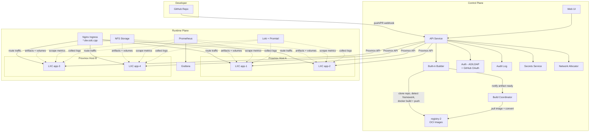

# System Architecture

TBD is organized into two planes: Control and Runtime. The Control Plane handles orchestration, builds, and policy. The Runtime Plane hosts LXC containers and supporting infrastructure. Each plane can be scaled independently.

## Audience
- **Developers**: understand where your code goes after you push.
- **Staff/Faculty**: understand what services run where and how to operate them.

## Mermaid Diagram

## Component Responsibilities

| Component | Plane | Role |
|---|---|---|
| Web UI | Control | Dashboard for developers and admin console for staff |
| API Service | Control | Orchestration, RBAC, workflow engine |
| Built-in Builder | Control | Clones repos, detects frameworks, generates Dockerfiles, builds and pushes OCI images |
| Auth (AD + GitHub OAuth) | Control | LDAP/Kerberos authentication, GitHub OAuth account linking, group-to-role mapping |
| Audit Log | Control | Immutable record of all platform actions |
| Secrets Service | Control | Encrypted storage, scoped access, env injection |
| Network Allocator | Control | Flat IP allocation (primary) or VLAN reservation, subnet mapping, DNS registration |
| Build Coordinator | Control | Accepts artifacts, triggers deploys, manages deploy queue |
| Scheduler | Control | Bin-pack placement by CPU/RAM, node health checks, drain |
| registry:2 | Control | Local OCI image registry, NFS-backed, basic auth |
| Proxmox Hosts | Runtime | LXC container lifecycle (unprivileged, Ubuntu 22.04 base) |
| NFS Storage | Runtime | Artifacts, persistent volumes, registry data |
| Nginx Ingress | Runtime | Wildcard routing for `*.dev.sdc.cpp`, health checks, per-deploy upstream configs |
| Prometheus | Runtime | Metrics scraping from hosts and apps |
| Grafana | Runtime | Dashboards for metrics and alerting |
| Loki + Promtail | Runtime | Centralized log aggregation from LXC journald |
