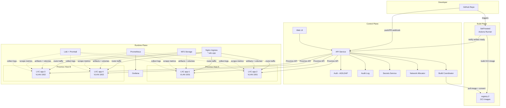

# System Architecture

TBD is organized into three planes: Control, Build, and Runtime. Each plane has distinct responsibilities and can be scaled independently.

## Audience
- **Developers**: understand where your code goes after you push.
- **Staff/Faculty**: understand what services run where and how to operate them.

## ASCII Diagram

```
+------------------------------------------------------------------+
|                         DEVELOPER                                |
|   [GitHub Repo] ---push/PR---> [GitHub Actions Runner]           |
+------------------------------------------------------------------+
        |                              |
        | webhook                      | OCI image push
        v                              v
+------------------+         +--------------------+
|  CONTROL PLANE   |         |   BUILD PLANE      |
|                  |         |                    |
|  +------------+  |         |  +==============+  |
|  | Web UI     |  |         |  | Self-hosted  |  |
|  +------------+  |         |  | Actions      |  |
|  | API Service|<-|---------|--| Runner       |  |
|  +------------+  |         |  +==============+  |
|  | Auth (AD)  |  |         |        |           |
|  +------------+  |         |        v           |
|  | Audit Log  |  |         |  +==============+  |
|  +------------+  |         |  | registry:2   |  |
|  | Secrets Svc|  |         |  | (OCI images) |  |
|  +------------+  |         |  +==============+  |
|  | Network    |  |         +--------------------+
|  | Allocator  |  |
|  +------------+  |
|  | Build      |  |
|  | Coordinator|  |
|  +------------+  |
+------------------+
        |
        | Proxmox API calls
        v
+------------------------------------------------------------------+
|                       RUNTIME PLANE                              |
|                                                                  |
|  +====================+  +====================+                  |
|  | Proxmox Host A     |  | Proxmox Host B     |                 |
|  |                    |  |                    |                  |
|  |  +------+ +------+ |  |  +------+ +------+ |                 |
|  |  | LXC  | | LXC  | |  |  | LXC  | | LXC  | |                |
|  |  | app-1| | app-2| |  |  | app-3| | app-4| |                |
|  |  +------+ +------+ |  |  +------+ +------+ |                |
|  |                    |  |                    |                  |
|  |  VLAN 1001         |  |  VLAN 1002         |                 |
|  +====================+  +====================+                  |
|                                                                  |
|  +====================+  +====================+                  |
|  | NFS Storage        |  | Nginx Ingress      |                 |
|  | - artifacts        |  | - *.sdc.cpp        |                 |
|  | - volumes          |  | - health checks    |                 |
|  | - registry data    |  | - routing          |                 |
|  +====================+  +====================+                  |
+------------------------------------------------------------------+
```

## Mermaid Diagram



## Component Responsibilities

| Component | Plane | Role |
|---|---|---|
| Web UI | Control | Dashboard for developers and admin console for staff |
| API Service | Control | Orchestration, RBAC, workflow engine |
| Auth (AD) | Control | LDAP/Kerberos authentication and group-to-role mapping |
| Audit Log | Control | Immutable record of all platform actions |
| Secrets Service | Control | Encrypted storage, scoped access, env injection |
| Network Allocator | Control | VLAN reservation, subnet mapping, DNS registration |
| Build Coordinator | Control | Accepts artifacts from Actions, triggers deploys |
| Scheduler | Control | Bin-pack placement by CPU/RAM, node health checks, drain |
| Actions Runner | Build | Self-hosted runner inside VPN, builds OCI images |
| registry:2 | Build | Local OCI image registry, NFS-backed, basic auth |
| Proxmox Hosts | Runtime | LXC container lifecycle (unprivileged, Ubuntu 22.04 base) |
| NFS Storage | Runtime | Artifacts, persistent volumes, registry data |
| Nginx Ingress | Runtime | Wildcard routing for `*.sdc.cpp`, health checks |
| Prometheus | Runtime | Metrics scraping from hosts and apps |
| Grafana | Runtime | Dashboards for metrics and alerting |
| Loki + Promtail | Runtime | Centralized log aggregation from LXC journald |
