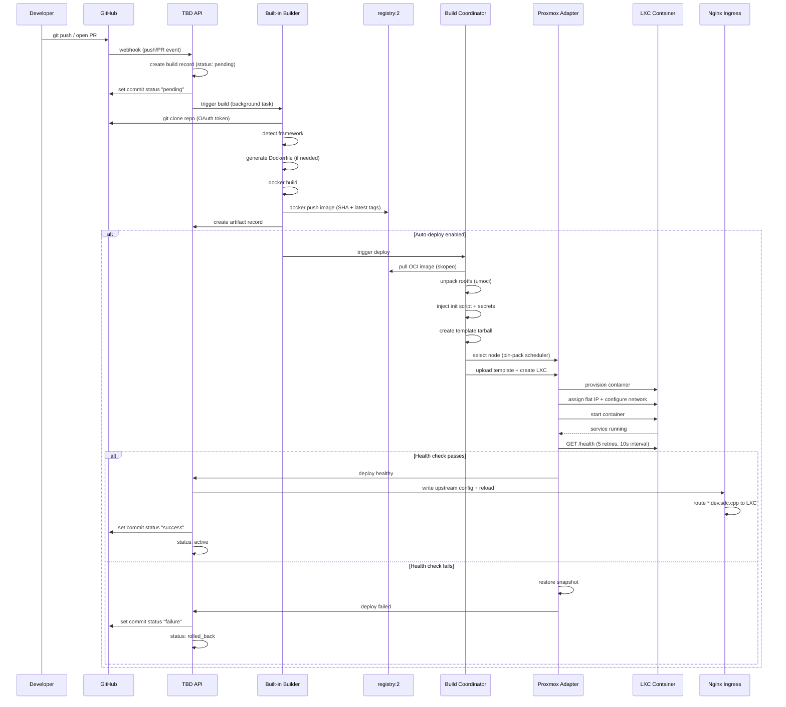

# Build and Deploy Flow

End-to-end workflow from code push to running application.

## Audience
- **Developers**: understand what happens after you push code.
- **Staff/Faculty**: understand the pipeline stages and where failures occur.

## Mermaid Diagram

## Step-by-step Breakdown

| Step | Actor | Action | Failure Mode |
|------|-------|--------|-------------|
| 1 | GitHub | Fires webhook to TBD API | API unreachable: retry with backoff |
| 2 | TBD API | Creates build record, sets pending status | DB write fail: return 500 to webhook |
| 3 | Built-in Builder | Clones repo using OAuth token | Clone fail: mark build failed |
| 4 | Built-in Builder | Detects runtime framework | Unknown framework: mark as `unknown`, attempt generic build |
| 5 | Built-in Builder | Generates Dockerfile (if no Dockerfile in repo) | Template error: mark build failed |
| 6 | Built-in Builder | Builds OCI image with `docker build` | Build error: mark build failed with logs |
| 7 | Built-in Builder | Pushes image to registry (SHA + latest tags) | Registry down: retry, then fail |
| 8 | Built-in Builder | Creates artifact record in DB | DB error: mark build failed |
| 9 | Deploy Executor | Pulls image from registry with skopeo | Pull fail: mark deploy failed |
| 10 | Deploy Executor | Unpacks OCI to rootfs with umoci | Corrupt image: mark deploy failed |
| 11 | Deploy Executor | Injects init script and secrets into rootfs | Template error: mark deploy failed |
| 12 | Deploy Executor | Creates template tarball for Proxmox | Disk full: mark deploy failed |
| 13 | Deploy Executor | Selects node (bin-pack scheduler) and uploads template | Proxmox API error: mark deploy failed |
| 14 | Deploy Executor | Creates/starts LXC container | Proxmox API error: mark deploy failed |
| 15 | Deploy Executor | Runs HTTP health check (5 retries, 10s interval) | Timeout/error: rollback to snapshot |
| 16 | TBD API | Writes Nginx upstream config and triggers reload | Config reload fail: alert staff |
| 17 | TBD API | Reports status back to GitHub | GitHub API error: log and retry |

## Preview Environment Flow

For pull requests, the flow is identical except:
- Environment type is `preview` instead of `production`.
- DNS entry is `<deployid>-<username>.dev.sdc.cpp`.
- LXC is destroyed when the PR is closed or merged.
- GitHub check includes the preview URL as a detail link.

## Production Promotion Flow

For pushes to `main`:
- Environment type is `production`.
- DNS entry is `<deployid>-<username>.dev.sdc.cpp`.
- Snapshot is taken before deploy for rollback safety.
- Old LXC is kept until the new one passes health checks.
