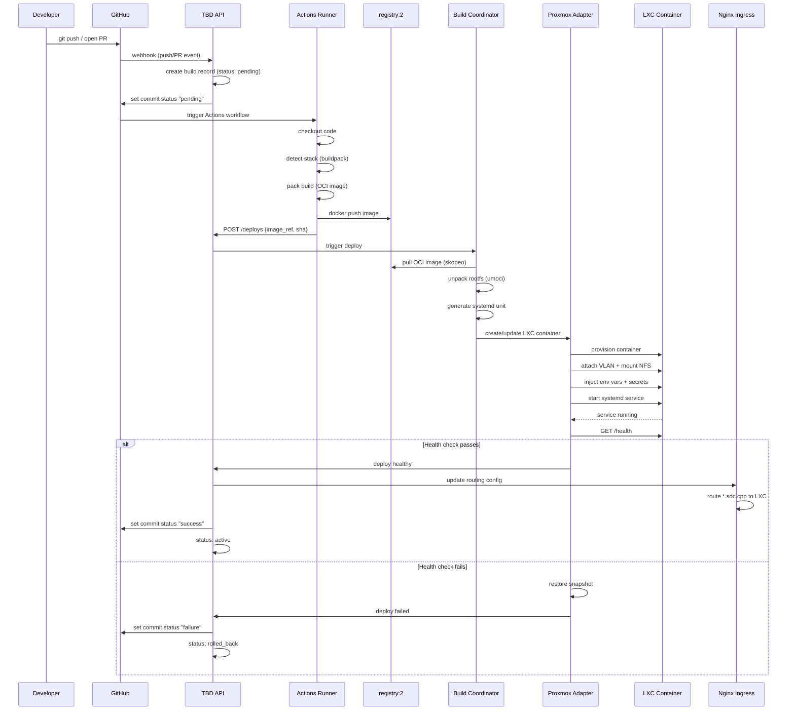

# Build and Deploy Flow

End-to-end workflow from code push to running application.

## Audience
- **Developers**: understand what happens after you push code.
- **Staff/Faculty**: understand the pipeline stages and where failures occur.

## ASCII Diagram

```
 Developer pushes code
        |
        v
 +------------------+
 | GitHub Repo      |
 | (push / PR)      |
 +------------------+
        |
        |  1. Webhook fires to TBD API
        |  2. GitHub Actions triggered
        v
 +------------------+       +------------------+
 | TBD API          |       | Actions Runner   |
 | - create build   |       | (self-hosted)    |
 | - set status:    |       |                  |
 |   "pending"      |       | 3. Checkout code |
 +------------------+       | 4. Detect stack  |
        |                   | 5. pack build    |
        |                   |    (buildpack)   |
        |                   | 6. docker push   |
        |                   |    to registry   |
        |                   +------------------+
        |                          |
        |    7. POST /deploys      |
        |    {image_ref, sha}      |
        |<-------------------------+
        |
        v
 +------------------+
 | Build Coordinator|
 | - validate image |
 | - resolve env    |
 | - allocate VLAN  |
 +------------------+
        |
        |  8. Pull OCI image (skopeo)
        |  9. Unpack rootfs (umoci)
        | 10. Generate systemd unit
        v
 +------------------+
 | Proxmox Adapter  |
 | - create/update  |
 |   LXC container  |
 | - attach VLAN    |
 | - mount NFS      |
 | - inject secrets |
 | - start service  |
 +------------------+
        |
        | 11. Health check: GET /health
        v
 +------------------+       +------------------+
 | Health Check     |--OK-->| Promote deploy   |
 | (HTTP /health)   |       | - update DNS     |
 |                  |       | - report success |
 |                  |       |   to GitHub      |
 +------------------+       +------------------+
        |
        | FAIL
        v
 +------------------+
 | Rollback         |
 | - restore snap   |
 | - report failure |
 |   to GitHub      |
 +------------------+
```

## Mermaid Diagram



## Step-by-step Breakdown

| Step | Actor | Action | Failure Mode |
|------|-------|--------|-------------|
| 1 | GitHub | Fires webhook to TBD API | API unreachable: retry with backoff |
| 2 | TBD API | Creates build record, sets pending status | DB write fail: return 500 to webhook |
| 3 | Actions Runner | Checks out code | Checkout fail: Actions reports error |
| 4 | Actions Runner | Detects runtime stack | Unknown stack: fail build with message |
| 5 | Actions Runner | Builds OCI image with `pack` | Build error: fail with logs |
| 6 | Actions Runner | Pushes image to registry | Registry down: retry, then fail |
| 7 | Actions Runner | Calls `POST /deploys` on TBD API | API reject: fail Actions step |
| 8 | Build Coordinator | Pulls image from registry | Pull fail: mark deploy failed |
| 9 | Build Coordinator | Unpacks OCI to rootfs | Corrupt image: mark deploy failed |
| 10 | Build Coordinator | Generates systemd unit | Template error: mark deploy failed |
| 11 | Proxmox Adapter | Creates/updates LXC, starts service | Proxmox API error: mark deploy failed |
| 12 | Proxmox Adapter | Runs HTTP health check | Timeout/error: rollback to snapshot |
| 13 | TBD API | Updates DNS routing via Nginx | Config reload fail: alert staff |
| 14 | TBD API | Reports status back to GitHub | GitHub API error: log and retry |

## Preview Environment Flow

For pull requests, the flow is identical except:
- Environment type is `preview` instead of `production`.
- DNS entry is `pr-<num>.<project>.sdc.cpp`.
- LXC is destroyed when the PR is closed or merged.
- GitHub check includes the preview URL as a detail link.

## Production Promotion Flow

For pushes to `main`:
- Environment type is `production`.
- DNS entry is `<project>.sdc.cpp`.
- Snapshot is taken before deploy for rollback safety.
- Old LXC is kept until the new one passes health checks.
