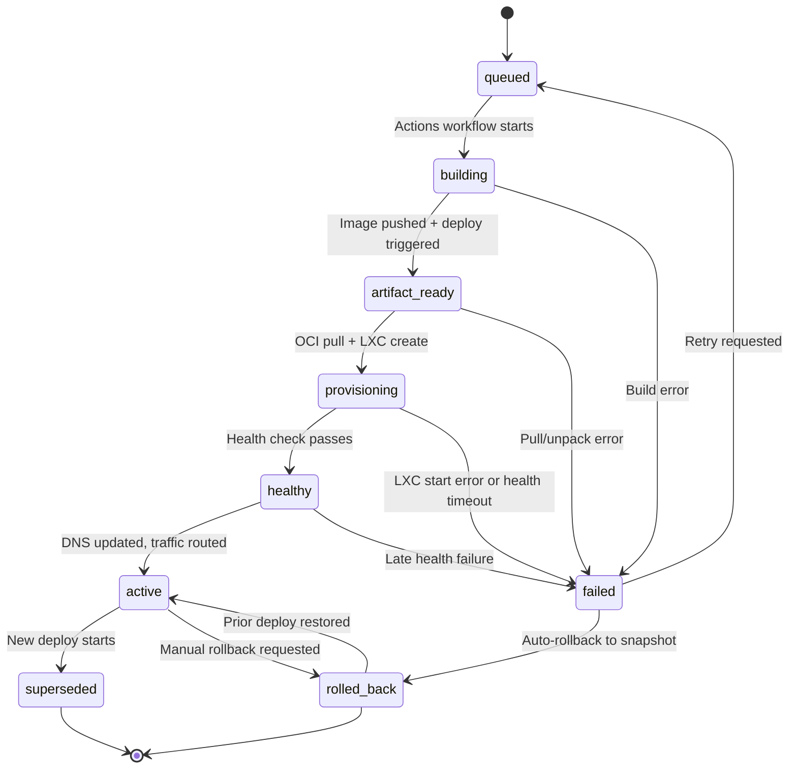

# Deploy State Machine

Every deploy in TBD transitions through a well-defined set of states. This document describes each state, the transitions between them, and how rollbacks work.

## Audience
- **Developers**: understand deploy status indicators in the UI and GitHub checks.
- **Staff/Faculty**: understand where a deploy can get stuck and how to intervene.

## ASCII Diagram

```
                          +----------+
                          | QUEUED   |
                          +----------+
                               |
                               | Actions workflow starts
                               v
                          +----------+
                     +--->| BUILDING |
                     |    +----------+
                     |         |
                     |         | Image pushed to registry
                     |         | POST /deploys received
                     |         v
                     |    +--------------+
                     |    | ARTIFACT     |
                     |    | READY        |
                     |    +--------------+
                     |         |
                     |         | skopeo pull + umoci unpack
                     |         | LXC create/update started
                     |         v
                     |    +--------------+
                     |    | PROVISIONING |
                     |    +--------------+
                     |         |
                     |         | LXC started, systemd running
                     |         | health check begins
                     |         v
                     |    +--------------+
                     |    | HEALTHY      |
                     |    +--------------+
                     |         |
                     |         | DNS updated, traffic routed
                     |         | GitHub status: success
                     |         v
                     |    +--------------+
                     |    | ACTIVE       |<-----------+
                     |    +--------------+            |
                     |         |                      |
                     |         | new deploy           | rollback
                     |         | starts               | succeeds
                     |         v                      |
                     |    +--------------+    +--------------+
                     |    | SUPERSEDED   |    | ROLLED BACK  |
                     |    +--------------+    +--------------+
                     |                               ^
                     |                               |
                     |    +--------------+            |
                     +----|  FAILED      |------------+
                          +--------------+
                               ^
                               |
              (any stage can transition to FAILED)
```

## Mermaid Diagram



## State Definitions

| State | Description | GitHub Check | UI Indicator |
|-------|-------------|-------------|-------------|
| `queued` | Deploy request received, waiting for build | pending | Gray dot |
| `building` | Actions workflow running, image being built | pending | Yellow spinner |
| `artifact_ready` | OCI image in registry, ready for provisioning | pending | Yellow dot |
| `provisioning` | LXC being created/updated, service starting | pending | Blue spinner |
| `healthy` | Health check passed, promoting | pending | Green spinner |
| `active` | Live, serving traffic | success | Green dot |
| `failed` | Error at any stage | failure | Red dot |
| `rolled_back` | Reverted to prior deploy snapshot | failure | Orange dot |
| `superseded` | Replaced by a newer deploy | (none) | Gray dot |

## Transitions

### Happy Path
```
queued -> building -> artifact_ready -> provisioning -> healthy -> active
```

### Failure + Auto-Rollback
```
queued -> building -> artifact_ready -> provisioning -> failed -> rolled_back
```

### Manual Rollback
```
active -> rolled_back (restores prior snapshot, re-routes traffic)
```

### Retry After Failure
```
failed -> queued (developer or staff triggers retry)
```

### Superseded by New Deploy
```
active -> superseded (new deploy reaches active state)
```

## Rollback Behavior

### Automatic Rollback
- Triggered when health check fails during `provisioning` or `healthy`.
- Proxmox adapter restores the pre-deploy LXC snapshot.
- DNS/Nginx routing remains on the prior active deploy.
- GitHub check is set to `failure`.
- Audit log records the rollback with reason.

### Manual Rollback
- Staff or developer triggers via UI or API: `POST /deploys/{id}/rollback`.
- Platform restores the specified prior deploy snapshot.
- DNS/Nginx routes back to the rolled-back deploy.
- Current active deploy moves to `superseded`.
- Audit log records who initiated the rollback.

## Timeouts and Retries

| Stage | Timeout | Retries | Action on Exhaust |
|-------|---------|---------|-------------------|
| Building | 10 min | 0 (Actions handles) | Mark failed |
| Pull image | 2 min | 3 | Mark failed |
| Unpack rootfs | 5 min | 1 | Mark failed |
| LXC provision | 3 min | 2 | Mark failed |
| Health check | 60 sec | 5 (every 10s) | Auto-rollback |
| DNS update | 30 sec | 3 | Alert staff |
