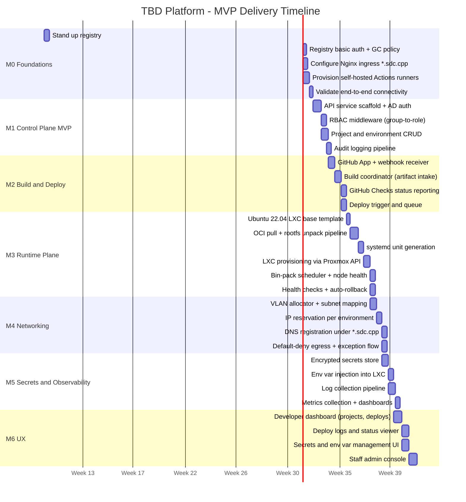
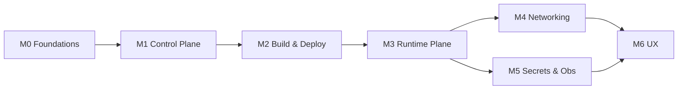

# Milestone Timeline

Phased delivery plan for TBD, from foundations through Kubernetes adoption.

## Audience
- **Developers**: understand when features become available.
- **Staff/Faculty**: understand infrastructure work, dependencies, and capacity planning.

## ASCII Timeline

```
 Week   1    2    3    4    5    6    7    8    9   10   11   12   13   14
       |----|----|----|----|----|----|----|----|----|----|----|----|----|----|
  M0   [==========]
  M1              [===============]
  M2                        [===============]
  M3                                  [===============]
  M4                                            [==========]
  M5                                                  [==========]
  M6                                                        [===============]

  M0: Foundations (registry, runners, Nginx)
  M1: Control Plane MVP (API, auth, RBAC, projects)
  M2: Build & Deploy (GitHub App, coordinator, checks)
  M3: Runtime Plane (OCI→LXC, systemd, health checks)
  M4: Networking (VLAN allocator, DNS registration)
  M5: Secrets & Observability (encrypted store, logs, metrics)
  M6: UX (Web UI for developers and staff)
```

## Mermaid Gantt Chart



## Milestone Details

### M0: Foundations (Weeks 1-2)
**Goal**: infrastructure prerequisites are operational.

| Ticket | Description | Depends On | Est |
|--------|-------------|-----------|-----|
| M0-1 | Deploy `registry:2` container with NFS-backed storage | NFS share | 3d |
| M0-2 | Configure basic auth (htpasswd) and weekly GC for registry | M0-1 | 2d |
| M0-3 | Configure Nginx for wildcard `*.sdc.cpp` | DNS record | 3d |
| M0-4 | Install and register self-hosted Actions runners | VPN access | 4d |
| M0-5 | Validate: push image to registry, pull from runner | M0-1, M0-4 | 2d |

**Exit criteria**: Actions runner can build an image, push to registry with auth, and Nginx resolves `*.sdc.cpp`.

---

### M1: Control Plane MVP (Weeks 2-4)
**Goal**: API service handles auth, projects, and audit.

| Ticket | Description | Depends On | Est |
|--------|-------------|-----------|-----|
| M1-1 | API scaffold with AD/LDAP authentication | AD endpoint | 5d |
| M1-2 | RBAC middleware with group-to-role mapping | M1-1 | 3d |
| M1-3 | Project and environment CRUD endpoints | M1-1 | 4d |
| M1-4 | Audit log writes on all mutations | M1-2 | 3d |

**Exit criteria**: authenticated user can create a project and see audit records.

---

### M2: Build and Deploy (Weeks 4-6)
**Goal**: GitHub integration triggers builds and reports status.

| Ticket | Description | Depends On | Est |
|--------|-------------|-----------|-----|
| M2-1 | GitHub App registration + webhook endpoint | M1-3 | 4d |
| M2-2 | Build coordinator: accept image_ref, create deploy record | M2-1 | 4d |
| M2-3 | Post commit status checks to GitHub | M2-2 | 3d |
| M2-4 | Deploy queue with ordering and concurrency limits | M2-2 | 3d |

**Exit criteria**: push to connected repo triggers a build record and GitHub shows pending/success checks.

---

### M3: Runtime Plane (Weeks 6-8)
**Goal**: OCI images are converted and running as LXC containers.

| Ticket | Description | Depends On | Est |
|--------|-------------|-----------|-----|
| M3-0 | Prepare Ubuntu 22.04 LXC base template (unprivileged, systemd) | Proxmox access | 2d |
| M3-1 | OCI pull (skopeo) + rootfs unpack (umoci) pipeline | M0-1, M2-2 | 5d |
| M3-2 | systemd unit generation from OCI config | M3-1 | 3d |
| M3-3 | LXC create/update via Proxmox API (unprivileged) | M3-2 | 4d |
| M3-4 | Bin-pack scheduler with node health checks and drain | M3-3 | 3d |
| M3-5 | HTTP health check + auto-rollback on failure | M3-3 | 3d |

**Exit criteria**: push to repo results in an unprivileged LXC container placed by the scheduler that passes health check.

---

### M4: Networking (Weeks 8-10)
**Goal**: projects get isolated VLANs and routable DNS.

| Ticket | Description | Depends On | Est |
|--------|-------------|-----------|-----|
| M4-1 | VLAN allocator with tag-to-subnet mapping | M1-3 | 4d |
| M4-2 | IP reservation per environment | M4-1 | 3d |
| M4-3 | DNS registration + Nginx upstream update | M4-2, M0-3 | 3d |
| M4-4 | Default-deny egress rules + per-project exception flow | M4-2 | 3d |

**Exit criteria**: new project gets a VLAN, preview env gets a routable URL, egress is blocked by default.

---

### M5: Secrets and Observability (Weeks 9-11)
**Goal**: secrets are secure and logs/metrics are collected.

| Ticket | Description | Depends On | Est |
|--------|-------------|-----------|-----|
| M5-1 | Encrypted secrets store (DB + encryption layer) | M1-3 | 4d |
| M5-2 | Env var injection into LXC at deploy time | M5-1, M3-3 | 3d |
| M5-3 | Log forwarding from LXC journald to aggregator | M3-3 | 4d |
| M5-4 | Metrics collection + Grafana dashboards | M5-3 | 3d |

**Exit criteria**: secrets injected, logs searchable, metrics visible in dashboard.

---

### M6: UX (Weeks 11-14)
**Goal**: developers and staff have a usable web interface.

| Ticket | Description | Depends On | Est |
|--------|-------------|-----------|-----|
| M6-1 | Developer dashboard: project list, deploy history | M1-3, M2-2 | 5d |
| M6-2 | Deploy log viewer and status page | M6-1, M5-3 | 4d |
| M6-3 | Secrets and env var management UI | M6-1, M5-1 | 4d |
| M6-4 | Staff admin console: quotas, VLANs, audit viewer | M6-1, M4-1 | 5d |

**Exit criteria**: developer can deploy an app and view logs entirely through the UI.

---

## Dependency Graph (Mermaid)



## Future Phases (post-MVP)

| Phase | Focus | Estimated Start |
|-------|-------|----------------|
| v1.1 | Autoscaling, blue/green deploys | Week 15 |
| v1.2 | Build cache, image retention policies | Week 18 |
| v2.0 | Kubernetes runtime plane on Proxmox VMs | Week 22+ |
