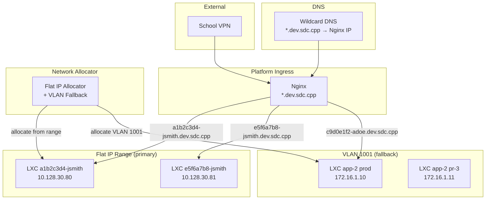

# Network and DNS Layout

How TBD allocates IPs, routes traffic through wildcard DNS, and segments projects.

## Audience
- **Developers**: understand how your app gets a URL and which network it runs on.
- **Staff/Faculty**: understand IP allocation, DNS routing, Nginx configuration, and network policies.

## Mermaid Diagram



## IP Allocation

TBD supports two networking modes. Flat IP is the primary mode; VLAN mode is a fallback for environments that require Layer 2 isolation.

### Flat IP Mode (Primary)

When `DEPLOY_IP_START` and `DEPLOY_IP_END` are configured, the deploy executor allocates IPs from a contiguous range on the existing network bridge.

**How it works:**
1. On deploy, the executor queries all TBD-tagged LXC containers across the Proxmox cluster.
2. It extracts each container's current IP from its `net0` configuration.
3. It walks the configured IP range and picks the first unused address.
4. The container is assigned the IP with the configured subnet bits and gateway.

**Configuration** (in `.env`):
```
DEPLOY_IP_START=10.128.30.80
DEPLOY_IP_END=10.128.30.200
DEPLOY_GATEWAY=10.128.30.1
DEPLOY_SUBNET_BITS=24
```

### VLAN Mode (Fallback)

When flat IP settings are not configured, the network allocator falls back to VLAN-based subnetting. Each project gets a dedicated VLAN for Layer 2 isolation.

#### VLAN Allocation Rules

The VLAN tag maps to the third octet of the subnet:

| VLAN Tag | Subnet | Project |
|----------|--------|---------|
| 1001 | 172.16.1.0/25 | app-1 |
| 1002 | 172.16.2.0/25 | app-2 |
| 1025 | 172.16.25.0/25 | app-25 |
| 1100 | 172.16.100.0/25 | app-100 |

#### Mapping Formula
```
VLAN tag:  1000 + N
Subnet:    172.16.N.0/25
Gateway:   172.16.N.1
Usable:    172.16.N.2 - 172.16.N.126
```

#### VLAN Allocation Process
1. Developer creates a project.
2. Network allocator reserves the next available VLAN tag.
3. Subnet is derived from the VLAN tag using the formula above.
4. Gateway and IP pool are registered in the `vlans` table.
5. Each environment (prod, preview) gets an IP from the pool.

#### VLAN IP Assignment

| Environment | IP Assignment | Example |
|-------------|--------------|---------|
| Production | First usable IP (.10) | 172.16.1.10 |
| Staging | .20 range | 172.16.1.20 |
| Preview PR-N | .100 + N | 172.16.1.105 (PR #5) |

Preview IPs are recycled when the PR is closed.

## DNS Routing

### Wildcard Domain
```
*.dev.sdc.cpp  →  <Nginx Ingress IP>
```

All subdomains resolve to the Nginx ingress. Nginx routes by hostname using dynamically generated upstream configs.

### URL Patterns

Deploy URLs use a deploy-ID-based scheme with a single-level subdomain:

| Type | URL Pattern | Example |
|------|------------|---------|
| Deploy | `<8-hex>-<username>.dev.sdc.cpp` | `a1b2c3d4-jsmith.dev.sdc.cpp` |
| Platform UI | `dev.sdc.cpp` | `dev.sdc.cpp` |
| Platform API | `api.dev.sdc.cpp` | `api.dev.sdc.cpp` |
| Registry | `registry.dev.sdc.cpp` | `registry.dev.sdc.cpp` |

The deploy ID is the first 8 hex characters of the deploy UUID (hyphens stripped). The username is the project owner's AD username, sanitized for DNS (lowercase, non-alphanumeric replaced with hyphens, max 63 chars).

### Nginx Server Blocks

The actual Nginx configuration uses these server blocks:

```nginx
# HTTP -> HTTPS redirect
server {
    listen 80;
    server_name _;
    return 301 https://$host$request_uri;
}

# Platform UI + API proxy
server {
    listen 443 ssl;
    server_name dev.sdc.cpp;

    location /api/ {
        proxy_pass http://tbd-api:8000/;  # strips /api prefix
    }

    location / {
        proxy_pass http://tbd-web:3000;
    }
}

# Direct API access
server {
    listen 443 ssl;
    server_name api.dev.sdc.cpp;

    location / {
        proxy_pass http://tbd-api:8000;
    }
}

# Registry proxy
server {
    listen 443 ssl;
    server_name registry.dev.sdc.cpp;
    client_max_body_size 0;  # unlimited for image layers

    location / {
        proxy_pass http://tbd-registry:5000;
    }
}

# Deploy catch-all (pending deploys)
server {
    listen 443 ssl;
    server_name ~^[0-9a-f]{8}-[a-z0-9][a-z0-9-]*\.dev\.sdc\.cpp$;

    # Serves a spinner page while deploy is in progress
    # /health returns 503 JSON
}
```

### Nginx Upstream Management
- The API writes per-deploy upstream config files to a shared volume (`/etc/nginx/conf.d/upstreams/*.conf`).
- Nginx is reloaded via a flag file mechanism (no downtime).
- Each active deploy gets an upstream entry mapping its hostname to its LXC IP.
- Dynamic upstream configs are included via `include /etc/nginx/conf.d/upstreams/*.conf`.

## Network Policies

Network policies are managed per-project through the admin API (`/admin/network-policies`).

### Default Policy
- Default deny: app containers cannot reach the internet or other projects by default.
- Allowed by default: NFS, internal DNS, platform API, and registry traffic.

### Policy Management
- Staff or faculty can approve per-project outbound exceptions via the admin UI or API.
- Each policy specifies: direction (egress/ingress), protocol, port, destination, and action (allow/deny).
- Policies can be enabled or disabled without deletion.
- All policy changes are recorded in the audit log.

### Firewall Rules (per project)
```
ALLOW: Nginx ingress IP → project (HTTP)
ALLOW: Platform API IP → project (health check)
ALLOW: NFS server IP → project (NFS)
ALLOW: Internal DNS IP → project (DNS)
ALLOW: registry.dev.sdc.cpp → project (registry pull)
DENY:  project → other projects (default)
DENY:  project → internet (default, unless exception granted)
```

## Capacity

| Resource | Default Limit | Override By |
|----------|--------------|-------------|
| Flat IPs per range | Configurable (IP_START to IP_END) | Env config |
| VLANs per project | 1 | Staff/Faculty |
| IPs per VLAN | 126 (/25) | Network design |
| Preview envs per project | 10 | Quotas table |
| Total VLANs | ~1000 (1001-1999) | Hardware/switch |
