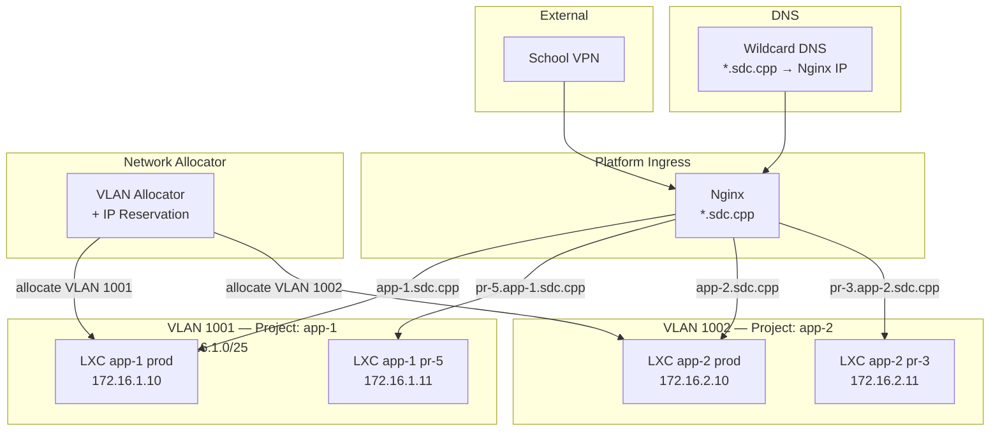

# Network and DNS Layout

How TBD allocates VLANs, maps subnets, segments projects, and routes traffic through wildcard DNS.

## Audience
- **Developers**: understand how your app gets a URL and which network it runs on.
- **Staff/Faculty**: understand VLAN allocation, subnet mapping, IP assignment, and Nginx routing.

## ASCII Diagram

```
                    INTERNET / SCHOOL VPN
                           |
                           v
                  +------------------+
                  | Upstream Router  |
                  | (Userlabs)       |
                  +------------------+
                           |
              +------------+------------+
              |                         |
     VLAN 1001 (trunk)        VLAN 1002 (trunk)
              |                         |
              v                         v
  +---------------------+   +---------------------+
  | Proxmox Bridge      |   | Proxmox Bridge      |
  | vmbr0 (tagged)      |   | vmbr0 (tagged)      |
  +---------------------+   +---------------------+
     |          |               |          |
     v          v               v          v
  +------+  +------+        +------+  +------+
  | LXC  |  | LXC  |        | LXC  |  | LXC  |
  | app-1|  | app-1|        | app-2|  | app-2|
  | prod |  | pr-5 |        | prod |  | pr-3 |
  +------+  +------+        +------+  +------+
  .10/25    .11/25           .10/25    .11/25

  172.16.1.0/25              172.16.2.0/25
  (Project: app-1)           (Project: app-2)


                  +------------------+
                  | Nginx Ingress    |
                  | *.sdc.cpp        |
                  +------------------+
                     |           |
        app-1.sdc.cpp           app-2.sdc.cpp
        pr-5.app-1.sdc.cpp     pr-3.app-2.sdc.cpp
```

## Mermaid Diagram



## VLAN Allocation Rules

### Naming Convention
The last 3-4 digits of a VLAN tag map to the third octet of the subnet.

| VLAN Tag | Subnet | Project |
|----------|--------|---------|
| 1001 | 172.16.1.0/25 | app-1 |
| 1002 | 172.16.2.0/25 | app-2 |
| 1025 | 172.16.25.0/25 | app-25 |
| 1100 | 172.16.100.0/25 | app-100 |

### Mapping Formula
```
VLAN tag:  1000 + N
Subnet:    172.16.N.0/25
Gateway:   172.16.N.1
Usable:    172.16.N.2 - 172.16.N.126
```

### Allocation Process
1. Developer creates a project.
2. Network allocator reserves the next available VLAN tag.
3. Subnet is derived from the VLAN tag using the formula above.
4. Gateway and IP pool are registered in the `vlans` table.
5. Each environment (prod, preview) gets an IP from the pool.

## IP Assignment

| Environment | IP Assignment | Example |
|-------------|--------------|---------|
| Production | First usable IP (.10) | 172.16.1.10 |
| Staging | .20 range | 172.16.1.20 |
| Preview PR-N | .100 + N | 172.16.1.105 (PR #5) |

Preview IPs are recycled when the PR is closed.

## DNS Routing

### Wildcard Domain
```
*.sdc.cpp  →  <Nginx Ingress IP>
```

All subdomains resolve to the Nginx ingress. Nginx routes by hostname.

### URL Patterns

| Type | URL Pattern | Example |
|------|------------|---------|
| Production | `<project>.sdc.cpp` | `app-1.sdc.cpp` |
| Preview | `pr-<num>.<project>.sdc.cpp` | `pr-5.app-1.sdc.cpp` |
| Staging | `staging.<project>.sdc.cpp` | `staging.app-1.sdc.cpp` |
| Platform UI | `tbd.sdc.cpp` | `tbd.sdc.cpp` |
| Registry | `registry.sdc.cpp` | `registry.sdc.cpp` |

### Nginx Configuration (template)

```nginx
# Production
server {
    listen 80;
    server_name ~^(?<project>[^.]+)\.sdc\.cpp$;

    location / {
        proxy_pass http://$project_upstream;
        proxy_set_header Host $host;
        proxy_set_header X-Real-IP $remote_addr;
    }

    location /health {
        proxy_pass http://$project_upstream/health;
    }
}

# Preview environments
server {
    listen 80;
    server_name ~^pr-(?<prnum>\d+)\.(?<project>[^.]+)\.sdc\.cpp$;

    location / {
        proxy_pass http://${project}_pr_${prnum}_upstream;
        proxy_set_header Host $host;
        proxy_set_header X-Real-IP $remote_addr;
    }
}
```

### Nginx Upstream Management
- Platform API updates Nginx upstream configs on deploy.
- Config is reloaded via `nginx -s reload` (no downtime).
- Upstream entries map hostnames to LXC IPs.

## Network Segmentation

### Isolation Rules
- Each project VLAN is isolated at Layer 2.
- Inter-project traffic is blocked by default.
- Only the Nginx ingress and platform API can reach app VLANs.
- Staff can override rules for debugging.

### Firewall Policy (per VLAN)
```
ALLOW: Nginx ingress IP → project VLAN (HTTP)
ALLOW: Platform API IP → project VLAN (health check, SSH)
ALLOW: NFS server IP → project VLAN (NFS)
ALLOW: Internal DNS IP → project VLAN (DNS)
ALLOW: registry.sdc.cpp IP → project VLAN (registry pull)
DENY:  project VLAN → other project VLANs
DENY:  project VLAN → internet (default)
```

### Egress Exceptions
- Internet access is denied by default for all app VLANs.
- Staff or faculty can approve per-project outbound exceptions.
- Approved projects get a NAT rule through the upstream gateway.
- All egress exceptions are recorded in the audit log.

## Capacity

| Resource | Default Limit | Override By |
|----------|--------------|-------------|
| VLANs per project | 1 | Staff/Faculty |
| IPs per VLAN | 126 (/25) | Network design |
| Preview envs per project | 10 | Quotas table |
| Total VLANs | ~1000 (1001-1999) | Hardware/switch |
