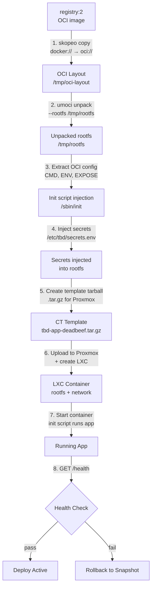

# OCI to LXC Conversion

How TBD converts OCI container images into running LXC containers on Proxmox.

## Audience
- **Developers**: understand why your app starts the way it does inside LXC.
- **Staff/Faculty**: understand the toolchain and where to debug conversion failures.

## Mermaid Diagram



## LXC Base Image and Container Model
- Base rootfs: the OCI image itself (no separate Ubuntu base template required).
- Container type: unprivileged LXC (no root mapping to host).
- Init system: custom `/sbin/init` shell script injected by the platform (Docker/OCI images typically lack an init system).
- The init script mounts pseudo-filesystems, configures networking, sets environment variables, and execs the app command as PID 1.
- App processes run inside the unpacked OCI rootfs.

## Toolchain

| Tool | Version | Purpose |
|------|---------|---------|
| `skopeo` | latest | Copy OCI images between registry and local layout |
| `umoci` | latest | Unpack OCI layout to rootfs directory |
| `docker` | 24+ | Build images from generated Dockerfiles |
| Proxmox API | 7.x+ | LXC lifecycle management |

## Init Script (replaces systemd)

Docker/OCI images do not include an init system. TBD injects a custom `/sbin/init` shell script into the unpacked rootfs that serves as PID 1 inside the LXC container.

The init script performs these steps in order:

1. **Mount pseudo-filesystems**: `/proc`, `/sys`, `/tmp`, `/run`, `/dev/pts`, `/dev/shm`
2. **Set hostname**: `{project_slug}-{env_name}`
3. **Configure networking**: bring up loopback, assign static IP to `eth0`, add default route, create `/etc/resolv.conf`
4. **Set OCI environment variables**: all `ENV` vars from the Docker image
5. **Set TBD platform variables**: `PORT`, `NODE_ENV`, `TBD_PROJECT`, `TBD_ENV`; sources `/etc/tbd/secrets.env`
6. **Fix PATH**: ensures standard directories are included
7. **Launch application**: `cd` to the OCI working directory, then `exec {cmd}` (app becomes PID 1)

### Install Process
- Creates `/etc/tbd/secrets.env` placeholder in the rootfs.
- Handles symlinked `/sbin/init` (common in Docker images -- removes the symlink).
- Backs up any existing `/sbin/init` as `/sbin/init.original`.
- Creates minimal `/etc/passwd` and `/etc/group` if missing (some Docker images lack them).
- Sets the init script as executable.

## Conversion Steps (detailed)

### Step 1: Pull image from registry
```bash
skopeo copy \
  docker://registry.dev.sdc.cpp/my-app:abc123 \
  oci:///var/lib/tbd/oci/my-app-abc123:latest
```
- Pulls from internal `registry:2` over the VPN.
- Stores as OCI layout on local disk.

### Step 2: Unpack to rootfs
```bash
umoci unpack \
  --image /var/lib/tbd/oci/my-app-abc123:latest \
  /var/lib/tbd/rootfs/my-app-abc123
```
- Produces a standard Linux filesystem tree.
- Contains application code, dependencies, and runtime.

### Step 3: Extract OCI config
```bash
umoci stat --image /var/lib/tbd/oci/my-app-abc123:latest --json
```
- Extracts `Cmd`, `Entrypoint`, `Env`, `ExposedPorts`, and `WorkingDir`.
- Platform uses these to generate the init script.

### Step 4: Inject init script
- Generates a `/sbin/init` shell script from the OCI config and network parameters.
- Installs it into the unpacked rootfs, backing up any existing `/sbin/init`.
- Creates `/etc/tbd/secrets.env` placeholder and ensures `/etc/passwd` and `/etc/group` exist.

### Step 5: Inject secrets
- Writes encrypted secrets from the platform DB into `/etc/tbd/secrets.env` in the rootfs.
- Non-fatal if secrets injection fails (container will start without secrets).

### Step 6: Create template tarball
```bash
tar -czf /tmp/tbd-my-app-abc12345.tar.gz -C /var/lib/tbd/rootfs/my-app-abc123 .
```
- Packages the prepared rootfs (with init script + secrets) into a `.tar.gz` file.
- This tarball is used as a Proxmox CT template (ostemplate).

### Step 7: Upload template and create LXC
```bash
# Upload tarball to Proxmox node
POST /api2/json/nodes/{node}/storage/{storage}/upload

# Create LXC from template
POST /api2/json/nodes/{node}/lxc
{
  "ostemplate": "{storage}:vztmpl/tbd-my-app-abc12345.tar.gz",
  "hostname": "my-app-abc12345",
  "unprivileged": 1,
  "net0": "name=eth0,bridge=vmbr0,ip=10.128.30.80/24,gw=10.128.30.1",
  "cores": 2,
  "memory": 512
}
```
- Bin-pack scheduler selects the target Proxmox node based on available CPU/RAM.
- If an existing LXC for this deploy exists, a snapshot is taken first for rollback.

### Step 8: Start and verify
```bash
# Start container
POST /api2/json/nodes/{node}/lxc/{vmid}/status/start

# Health check (from platform, 5 retries, 10s interval)
curl -sf http://10.128.30.80:{port}/health
```

## Failure Modes

| Stage | Failure | Recovery |
|-------|---------|----------|
| Pull | Registry unreachable | Retry with backoff, alert staff |
| Pull | Image not found | Mark deploy failed, notify developer |
| Unpack | Corrupt layers | Mark deploy failed, log details |
| Init script | Template error | Mark deploy failed, log details |
| Secrets | Injection error | Non-fatal, container starts without secrets |
| Tarball | Disk full or permission error | Mark deploy failed, alert staff |
| Upload | Proxmox upload timeout (300s) | Mark deploy failed, alert staff |
| LXC create | Proxmox API error | Mark deploy failed, alert staff |
| LXC create | Resource quota exceeded | Mark deploy failed, notify developer |
| Start | Service crash loop | Rollback to previous snapshot |
| Health | Timeout or HTTP error (60s total) | Rollback to previous snapshot |
