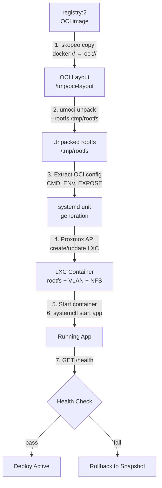

# OCI to LXC Conversion

How TBD converts OCI container images into running LXC containers on Proxmox.

## Audience
- **Developers**: understand why your app starts the way it does inside LXC.
- **Staff/Faculty**: understand the toolchain and where to debug conversion failures.

## ASCII Diagram

```
 registry:2 (OCI image store)
        |
        | 1. skopeo copy
        |    docker://registry.sdc.cpp/tbd/app:sha
        |    oci:///tmp/oci-layout:latest
        v
 +------------------+
 | OCI Layout       |
 | /tmp/oci-layout  |
 | - index.json     |
 | - blobs/         |
 | - oci-layout     |
 +------------------+
        |
        | 2. umoci unpack
        |    --image /tmp/oci-layout:latest
        |    --rootfs /tmp/rootfs
        v
 +------------------+
 | Unpacked rootfs  |
 | /tmp/rootfs      |
 | - bin/           |
 | - etc/           |
 | - usr/           |
 | - app/           |  <-- application code + deps
 +------------------+
        |
        | 3. Extract OCI config
        |    - CMD / ENTRYPOINT
        |    - ENV vars
        |    - EXPOSE port
        v
 +------------------+
 | systemd unit     |
 | generation       |
 |                  |
 | [Unit]           |
 | Description=app  |
 | After=network    |
 |                  |
 | [Service]        |
 | ExecStart=<CMD>  |
 | Environment=     |
 |   PORT=<port>    |
 |   <secrets...>   |
 | Restart=always   |
 | WorkingDir=/app  |
 |                  |
 | [Install]        |
 | WantedBy=multi.. |
 +------------------+
        |
        | 4. Proxmox API
        |    - create/update LXC
        |    - set rootfs path
        |    - attach VLAN NIC
        |    - mount NFS volumes
        v
 +------------------+
 | LXC Container    |
 | on Proxmox       |
 |                  |
 | rootfs: unpacked |
 | net0: VLAN tagged|
 | mp0: NFS mount   |
 | systemd: app.svc |
 +------------------+
        |
        | 5. Start container
        | 6. systemctl start app
        | 7. GET /health
        v
 +------------------+
 | Running app      |
 | listening on     |
 | $PORT            |
 +------------------+
```

## Mermaid Diagram



## LXC Base Image and Container Model
- Base rootfs: Ubuntu 22.04 LTS (minimal server image).
- Container type: unprivileged LXC (no root mapping to host).
- Init system: systemd enabled inside the container.
- App processes run as a non-root user (`tbd-app`, UID 1000).
- The OCI rootfs is layered on top of the base image during unpack.

## Toolchain

| Tool | Version | Purpose |
|------|---------|---------|
| `skopeo` | latest | Copy OCI images between registry and local layout |
| `umoci` | latest | Unpack OCI layout to rootfs directory |
| Proxmox API | 7.x+ | LXC lifecycle management |
| `systemd` | (in LXC) | App process management and restart |

## systemd Unit Template

```ini
[Unit]
Description=TBD App - {project_name} ({env_name})
After=network-online.target
Wants=network-online.target

[Service]
Type=simple
ExecStart={entrypoint_cmd}
WorkingDirectory={workdir}
Restart=always
RestartSec=5

# Injected by TBD platform
Environment=PORT={port}
Environment=NODE_ENV={env_type}
EnvironmentFile=/etc/tbd/secrets.env

# Logging to stdout/stderr for collection
StandardOutput=journal
StandardError=journal
SyslogIdentifier=tbd-{project_name}

[Install]
WantedBy=multi-user.target
```

## Conversion Steps (detailed)

### Step 1: Pull image from registry
```bash
skopeo copy \
  docker://registry.sdc.cpp/tbd/my-app:abc123 \
  oci:///var/lib/tbd/oci/my-app-abc123:latest
```
- Pulls from internal `registry:2` over the VPN.
- Stores as OCI layout on local disk (or NFS).

### Step 2: Unpack to rootfs
```bash
umoci unpack \
  --image /var/lib/tbd/oci/my-app-abc123:latest \
  /var/lib/tbd/rootfs/my-app-abc123
```
- Produces a standard Linux filesystem tree.
- Contains application code, dependencies, and runtime.

### Step 3: Extract OCI config
```bash
umoci stat --image /var/lib/tbd/oci/my-app-abc123:latest --json
```
- Extracts `Cmd`, `Entrypoint`, `Env`, `ExposedPorts`, and `WorkingDir`.
- Platform uses these to generate the systemd unit.

### Step 4: Create/update LXC
```bash
# Via Proxmox API (simplified)
POST /api2/json/nodes/{node}/lxc
{
  "ostemplate": "local:vztmpl/ubuntu-22.04-standard_amd64.tar.zst",
  "rootfs": "local:/var/lib/tbd/rootfs/my-app-abc123",
  "hostname": "my-app-preview-42",
  "unprivileged": 1,
  "net0": "name=eth0,bridge=vmbr0,tag=1001,ip=172.16.1.10/25,gw=172.16.1.1",
  "mp0": "/mnt/nfs/my-app:/data,mp=/data",
  "cores": 2,
  "memory": 512
}
```

### Step 5: Start and verify
```bash
# Start container
POST /api2/json/nodes/{node}/lxc/{vmid}/status/start

# Health check (from platform)
curl -sf http://172.16.1.10:{port}/health
```

## Failure Modes

| Stage | Failure | Recovery |
|-------|---------|----------|
| Pull | Registry unreachable | Retry with backoff, alert staff |
| Pull | Image not found | Mark deploy failed, notify developer |
| Unpack | Corrupt layers | Mark deploy failed, log details |
| LXC create | Proxmox API error | Mark deploy failed, alert staff |
| LXC create | Resource quota exceeded | Mark deploy failed, notify developer |
| Start | Service crash loop | Rollback to previous snapshot |
| Health | Timeout or HTTP error | Rollback to previous snapshot |
